# Analyse de Udemy

## Import et installation


```python
import pandas as pd
import numpy as np
import re
import matplotlib.pyplot as plt
import matplotlib.cm as cm
import seaborn as sns
import skimpy 
from skimpy import skim
```

## Création du DataFrame de base


```python
data = pd.read_csv("udemy_courses_dataset.csv", sep=",", low_memory=False)
```


```python
df= data
```


```python
df = df.drop('url', axis=1)
```


```python
df.info()
```

    <class 'pandas.core.frame.DataFrame'>
    RangeIndex: 3678 entries, 0 to 3677
    Data columns (total 11 columns):
     #   Column               Non-Null Count  Dtype  
    ---  ------               --------------  -----  
     0   course_id            3678 non-null   int64  
     1   course_title         3678 non-null   object 
     2   is_paid              3678 non-null   bool   
     3   price                3678 non-null   int64  
     4   num_subscribers      3678 non-null   int64  
     5   num_reviews          3678 non-null   int64  
     6   num_lectures         3678 non-null   int64  
     7   level                3678 non-null   object 
     8   content_duration     3678 non-null   float64
     9   published_timestamp  3678 non-null   object 
     10  subject              3678 non-null   object 
    dtypes: bool(1), float64(1), int64(5), object(4)
    memory usage: 291.1+ KB


```python
df.describe().T
```


<div>
<table border="1" class="dataframe">
  <thead>
    <tr style="text-align: right;">
      <th></th>
      <th>count</th>
      <th>mean</th>
      <th>std</th>
      <th>min</th>
      <th>25%</th>
      <th>50%</th>
      <th>75%</th>
      <th>max</th>
    </tr>
  </thead>
  <tbody>
    <tr>
      <th>course_id</th>
      <td>3678.0</td>
      <td>675971.963295</td>
      <td>343273.156040</td>
      <td>8324.0</td>
      <td>407692.5</td>
      <td>687917.0</td>
      <td>961355.50</td>
      <td>1282064.0</td>
    </tr>
    <tr>
      <th>price</th>
      <td>3678.0</td>
      <td>66.049483</td>
      <td>61.005755</td>
      <td>0.0</td>
      <td>20.0</td>
      <td>45.0</td>
      <td>95.00</td>
      <td>200.0</td>
    </tr>
    <tr>
      <th>num_subscribers</th>
      <td>3678.0</td>
      <td>3197.150625</td>
      <td>9504.117010</td>
      <td>0.0</td>
      <td>111.0</td>
      <td>911.5</td>
      <td>2546.00</td>
      <td>268923.0</td>
    </tr>
    <tr>
      <th>num_reviews</th>
      <td>3678.0</td>
      <td>156.259108</td>
      <td>935.452044</td>
      <td>0.0</td>
      <td>4.0</td>
      <td>18.0</td>
      <td>67.00</td>
      <td>27445.0</td>
    </tr>
    <tr>
      <th>num_lectures</th>
      <td>3678.0</td>
      <td>40.108755</td>
      <td>50.383346</td>
      <td>0.0</td>
      <td>15.0</td>
      <td>25.0</td>
      <td>45.75</td>
      <td>779.0</td>
    </tr>
    <tr>
      <th>content_duration</th>
      <td>3678.0</td>
      <td>4.094517</td>
      <td>6.053840</td>
      <td>0.0</td>
      <td>1.0</td>
      <td>2.0</td>
      <td>4.50</td>
      <td>78.5</td>
    </tr>
  </tbody>
</table>
</div>


On remarque que l'écart-type entre le nombre d'abonnés est très grand.


```python
df.describe(include="object").T
```


<div>
<table border="1" class="dataframe">
  <thead>
    <tr style="text-align: right;">
      <th></th>
      <th>count</th>
      <th>unique</th>
      <th>top</th>
      <th>freq</th>
    </tr>
  </thead>
  <tbody>
    <tr>
      <th>course_title</th>
      <td>3678</td>
      <td>3663</td>
      <td>Creating an animated greeting card via Google ...</td>
      <td>3</td>
    </tr>
    <tr>
      <th>level</th>
      <td>3678</td>
      <td>4</td>
      <td>All Levels</td>
      <td>1929</td>
    </tr>
    <tr>
      <th>published_timestamp</th>
      <td>3678</td>
      <td>3672</td>
      <td>2017-07-02T14:29:35Z</td>
      <td>2</td>
    </tr>
    <tr>
      <th>subject</th>
      <td>3678</td>
      <td>4</td>
      <td>Web Development</td>
      <td>1200</td>
    </tr>
  </tbody>
</table>
</div>


```python
data_subject = df['subject'].value_counts()
data_subject 
```


    subject
    Web Development        1200
    Business Finance       1195
    Musical Instruments     680
    Graphic Design          603
    Name: count, dtype: int64


```python
data_level = df['level'].value_counts()
data_level
```


    level
    All Levels            1929
    Beginner Level        1270
    Intermediate Level     421
    Expert Level            58
    Name: count, dtype: int64


- Pour course_title, il y a 3663 titres différents sur 3678 cours (certains titres sont répétés). Notamment " Creating an animated greeting card via Google ..." qui apparaît 3 fois.
- level , il y a 4 niveaux "All levels " , "Beginner", " Intermediaire", "Expert".
  On remarque donc que le niveau "All levels" est de loin le plus courant ( 52.45 % des cours)
- subject , il y a 4 sujets différents ("Web Developpement", "Buisness Finance", "Musical Instruments" et "Graphic Design". Le subject le plus courant étant "Web Developpement" ( 32.63% des cours)


```python
skim(df)
```


<pre style="white-space:pre;overflow-x:auto;line-height:normal;font-family:Menlo,'DejaVu Sans Mono',consolas,'Courier New',monospace">╭──────────────────────────────────────────────── skimpy summary ─────────────────────────────────────────────────╮
│ <span style="font-style: italic">         Data Summary         </span> <span style="font-style: italic">      Data Types       </span>                                                          │
│ ┏━━━━━━━━━━━━━━━━━━━┳━━━━━━━━┓ ┏━━━━━━━━━━━━━┳━━━━━━━┓                                                          │
│ ┃<span style="color: #008080; text-decoration-color: #008080; font-weight: bold"> dataframe         </span>┃<span style="color: #008080; text-decoration-color: #008080; font-weight: bold"> Values </span>┃ ┃<span style="color: #008080; text-decoration-color: #008080; font-weight: bold"> Column Type </span>┃<span style="color: #008080; text-decoration-color: #008080; font-weight: bold"> Count </span>┃                                                          │
│ ┡━━━━━━━━━━━━━━━━━━━╇━━━━━━━━┩ ┡━━━━━━━━━━━━━╇━━━━━━━┩                                                          │
│ │ Number of rows    │ 3678   │ │ int64       │ 5     │                                                          │
│ │ Number of columns │ 11     │ │ string      │ 4     │                                                          │
│ └───────────────────┴────────┘ │ bool        │ 1     │                                                          │
│                                │ float64     │ 1     │                                                          │
│                                └─────────────┴───────┘                                                          │
│ <span style="font-style: italic">                                                    number                                                    </span>  │
│ ┏━━━━━━━━━━━━━━━━━━━━┳━━━━━┳━━━━━━━┳━━━━━━━━━┳━━━━━━━━━┳━━━━━━━┳━━━━━━━━┳━━━━━━━━┳━━━━━━━━┳━━━━━━━━━┳━━━━━━━━┓  │
│ ┃<span style="font-weight: bold"> column_name        </span>┃<span style="font-weight: bold"> NA  </span>┃<span style="font-weight: bold"> NA %  </span>┃<span style="font-weight: bold"> mean    </span>┃<span style="font-weight: bold"> sd      </span>┃<span style="font-weight: bold"> p0    </span>┃<span style="font-weight: bold"> p25    </span>┃<span style="font-weight: bold"> p50    </span>┃<span style="font-weight: bold"> p75    </span>┃<span style="font-weight: bold"> p100    </span>┃<span style="font-weight: bold"> hist   </span>┃  │
│ ┡━━━━━━━━━━━━━━━━━━━━╇━━━━━╇━━━━━━━╇━━━━━━━━━╇━━━━━━━━━╇━━━━━━━╇━━━━━━━━╇━━━━━━━━╇━━━━━━━━╇━━━━━━━━━╇━━━━━━━━┩  │
│ │ <span style="color: #af87ff; text-decoration-color: #af87ff">course_id         </span> │ <span style="color: #008080; text-decoration-color: #008080">  0</span> │ <span style="color: #008080; text-decoration-color: #008080">    0</span> │ <span style="color: #008080; text-decoration-color: #008080"> 676000</span> │ <span style="color: #008080; text-decoration-color: #008080"> 343300</span> │ <span style="color: #008080; text-decoration-color: #008080"> 8324</span> │ <span style="color: #008080; text-decoration-color: #008080">407700</span> │ <span style="color: #008080; text-decoration-color: #008080">687900</span> │ <span style="color: #008080; text-decoration-color: #008080">961400</span> │ <span style="color: #008080; text-decoration-color: #008080">1282000</span> │ <span style="color: #008000; text-decoration-color: #008000">▅▆▇▇▇▆</span> │  │
│ │ <span style="color: #af87ff; text-decoration-color: #af87ff">price             </span> │ <span style="color: #008080; text-decoration-color: #008080">  0</span> │ <span style="color: #008080; text-decoration-color: #008080">    0</span> │ <span style="color: #008080; text-decoration-color: #008080">  66.05</span> │ <span style="color: #008080; text-decoration-color: #008080">  61.01</span> │ <span style="color: #008080; text-decoration-color: #008080">    0</span> │ <span style="color: #008080; text-decoration-color: #008080">    20</span> │ <span style="color: #008080; text-decoration-color: #008080">    45</span> │ <span style="color: #008080; text-decoration-color: #008080">    95</span> │ <span style="color: #008080; text-decoration-color: #008080">    200</span> │ <span style="color: #008000; text-decoration-color: #008000">▇▆▂▁▁▃</span> │  │
│ │ <span style="color: #af87ff; text-decoration-color: #af87ff">num_subscribers   </span> │ <span style="color: #008080; text-decoration-color: #008080">  0</span> │ <span style="color: #008080; text-decoration-color: #008080">    0</span> │ <span style="color: #008080; text-decoration-color: #008080">   3197</span> │ <span style="color: #008080; text-decoration-color: #008080">   9504</span> │ <span style="color: #008080; text-decoration-color: #008080">    0</span> │ <span style="color: #008080; text-decoration-color: #008080">   111</span> │ <span style="color: #008080; text-decoration-color: #008080"> 911.5</span> │ <span style="color: #008080; text-decoration-color: #008080">  2546</span> │ <span style="color: #008080; text-decoration-color: #008080"> 268900</span> │ <span style="color: #008000; text-decoration-color: #008000">  ▇   </span> │  │
│ │ <span style="color: #af87ff; text-decoration-color: #af87ff">num_reviews       </span> │ <span style="color: #008080; text-decoration-color: #008080">  0</span> │ <span style="color: #008080; text-decoration-color: #008080">    0</span> │ <span style="color: #008080; text-decoration-color: #008080">  156.3</span> │ <span style="color: #008080; text-decoration-color: #008080">  935.5</span> │ <span style="color: #008080; text-decoration-color: #008080">    0</span> │ <span style="color: #008080; text-decoration-color: #008080">     4</span> │ <span style="color: #008080; text-decoration-color: #008080">    18</span> │ <span style="color: #008080; text-decoration-color: #008080">    67</span> │ <span style="color: #008080; text-decoration-color: #008080">  27440</span> │ <span style="color: #008000; text-decoration-color: #008000">  ▇   </span> │  │
│ │ <span style="color: #af87ff; text-decoration-color: #af87ff">num_lectures      </span> │ <span style="color: #008080; text-decoration-color: #008080">  0</span> │ <span style="color: #008080; text-decoration-color: #008080">    0</span> │ <span style="color: #008080; text-decoration-color: #008080">  40.11</span> │ <span style="color: #008080; text-decoration-color: #008080">  50.38</span> │ <span style="color: #008080; text-decoration-color: #008080">    0</span> │ <span style="color: #008080; text-decoration-color: #008080">    15</span> │ <span style="color: #008080; text-decoration-color: #008080">    25</span> │ <span style="color: #008080; text-decoration-color: #008080"> 45.75</span> │ <span style="color: #008080; text-decoration-color: #008080">    779</span> │ <span style="color: #008000; text-decoration-color: #008000">  ▇   </span> │  │
│ │ <span style="color: #af87ff; text-decoration-color: #af87ff">content_duration  </span> │ <span style="color: #008080; text-decoration-color: #008080">  0</span> │ <span style="color: #008080; text-decoration-color: #008080">    0</span> │ <span style="color: #008080; text-decoration-color: #008080">  4.095</span> │ <span style="color: #008080; text-decoration-color: #008080">  6.054</span> │ <span style="color: #008080; text-decoration-color: #008080">    0</span> │ <span style="color: #008080; text-decoration-color: #008080">     1</span> │ <span style="color: #008080; text-decoration-color: #008080">     2</span> │ <span style="color: #008080; text-decoration-color: #008080">   4.5</span> │ <span style="color: #008080; text-decoration-color: #008080">   78.5</span> │ <span style="color: #008000; text-decoration-color: #008000">  ▇   </span> │  │
│ └────────────────────┴─────┴───────┴─────────┴─────────┴───────┴────────┴────────┴────────┴─────────┴────────┘  │
│ <span style="font-style: italic">                                                     bool                                                     </span>  │
│ ┏━━━━━━━━━━━━━━━━━━━━━━━━━━━━━━━━━━━━┳━━━━━━━━━━━━━━━━━┳━━━━━━━━━━━━━━━━━━━━━━━━━━━━━━━┳━━━━━━━━━━━━━━━━━━━━━┓  │
│ ┃<span style="font-weight: bold"> column_name                        </span>┃<span style="font-weight: bold"> true            </span>┃<span style="font-weight: bold"> true rate                     </span>┃<span style="font-weight: bold"> hist                </span>┃  │
│ ┡━━━━━━━━━━━━━━━━━━━━━━━━━━━━━━━━━━━━╇━━━━━━━━━━━━━━━━━╇━━━━━━━━━━━━━━━━━━━━━━━━━━━━━━━╇━━━━━━━━━━━━━━━━━━━━━┩  │
│ │ <span style="color: #af87ff; text-decoration-color: #af87ff">is_paid                           </span> │ <span style="color: #008080; text-decoration-color: #008080">           3368</span> │ <span style="color: #008080; text-decoration-color: #008080">                         0.92</span> │ <span style="color: #008000; text-decoration-color: #008000">      ▁    ▇       </span> │  │
│ └────────────────────────────────────┴─────────────────┴───────────────────────────────┴─────────────────────┘  │
│ <span style="font-style: italic">                                                    string                                                    </span>  │
│ ┏━━━━━━━━━━━━━━━━━━━━━━━━━━━━━━━━━━━━━━┳━━━━━━━┳━━━━━━━━━━━┳━━━━━━━━━━━━━━━━━━━━━━━━━━┳━━━━━━━━━━━━━━━━━━━━━━┓  │
│ ┃<span style="font-weight: bold"> column_name                          </span>┃<span style="font-weight: bold"> NA    </span>┃<span style="font-weight: bold"> NA %      </span>┃<span style="font-weight: bold"> words per row            </span>┃<span style="font-weight: bold"> total words          </span>┃  │
│ ┡━━━━━━━━━━━━━━━━━━━━━━━━━━━━━━━━━━━━━━╇━━━━━━━╇━━━━━━━━━━━╇━━━━━━━━━━━━━━━━━━━━━━━━━━╇━━━━━━━━━━━━━━━━━━━━━━┩  │
│ │ <span style="color: #af87ff; text-decoration-color: #af87ff">course_title                        </span> │ <span style="color: #008080; text-decoration-color: #008080">    0</span> │ <span style="color: #008080; text-decoration-color: #008080">        0</span> │ <span style="color: #008080; text-decoration-color: #008080">                     7.2</span> │ <span style="color: #008080; text-decoration-color: #008080">               26418</span> │  │
│ │ <span style="color: #af87ff; text-decoration-color: #af87ff">level                               </span> │ <span style="color: #008080; text-decoration-color: #008080">    0</span> │ <span style="color: #008080; text-decoration-color: #008080">        0</span> │ <span style="color: #008080; text-decoration-color: #008080">                       2</span> │ <span style="color: #008080; text-decoration-color: #008080">                7356</span> │  │
│ │ <span style="color: #af87ff; text-decoration-color: #af87ff">published_timestamp                 </span> │ <span style="color: #008080; text-decoration-color: #008080">    0</span> │ <span style="color: #008080; text-decoration-color: #008080">        0</span> │ <span style="color: #008080; text-decoration-color: #008080">                       1</span> │ <span style="color: #008080; text-decoration-color: #008080">                3678</span> │  │
│ │ <span style="color: #af87ff; text-decoration-color: #af87ff">subject                             </span> │ <span style="color: #008080; text-decoration-color: #008080">    0</span> │ <span style="color: #008080; text-decoration-color: #008080">        0</span> │ <span style="color: #008080; text-decoration-color: #008080">                       2</span> │ <span style="color: #008080; text-decoration-color: #008080">                7356</span> │  │
│ └──────────────────────────────────────┴───────┴───────────┴──────────────────────────┴──────────────────────┘  │
╰────────────────────────────────────────────────────── End ──────────────────────────────────────────────────────╯
</pre>


On peut remarquer, grâce à ce tableau, que 92% des cours proposés par Udemy sont payant.


```python
filtre1=df['is_paid']==True
df_paid = df[filtre1]
df_paid.sample(5)
```


<div>
<table border="1" class="dataframe">
  <thead>
    <tr style="text-align: right;">
      <th></th>
      <th>course_id</th>
      <th>course_title</th>
      <th>is_paid</th>
      <th>price</th>
      <th>price_category</th>
      <th>num_subscribers</th>
      <th>num_reviews</th>
      <th>num_lectures</th>
      <th>level</th>
      <th>content_duration</th>
      <th>published_time</th>
      <th>year</th>
      <th>subject</th>
      <th>revenue</th>
      <th>interval</th>
    </tr>
  </thead>
  <tbody>
    <tr>
      <th>3491</th>
      <td>1249968</td>
      <td>JQuery Basics - Learn JQuery From Scratch</td>
      <td>1</td>
      <td>100</td>
      <td>Moyen</td>
      <td>3559</td>
      <td>24</td>
      <td>18</td>
      <td>Beginner Level</td>
      <td>1.0</td>
      <td>NaN</td>
      <td>2017</td>
      <td>Web Development</td>
      <td>355900</td>
      <td>100-125</td>
    </tr>
    <tr>
      <th>3343</th>
      <td>523312</td>
      <td>Python Web Programming</td>
      <td>1</td>
      <td>100</td>
      <td>Moyen</td>
      <td>1020</td>
      <td>46</td>
      <td>60</td>
      <td>Beginner Level</td>
      <td>6.0</td>
      <td>NaN</td>
      <td>2015</td>
      <td>Web Development</td>
      <td>102000</td>
      <td>100-125</td>
    </tr>
    <tr>
      <th>1275</th>
      <td>463354</td>
      <td>Editorial Illustration Tutorial: From Drawing ...</td>
      <td>1</td>
      <td>45</td>
      <td>Faible</td>
      <td>774</td>
      <td>39</td>
      <td>35</td>
      <td>All Levels</td>
      <td>2.5</td>
      <td>NaN</td>
      <td>2015</td>
      <td>Graphic Design</td>
      <td>34830</td>
      <td>25-50</td>
    </tr>
    <tr>
      <th>3351</th>
      <td>420982</td>
      <td>Learning 200 jQuery Functions with 800 Examples</td>
      <td>1</td>
      <td>195</td>
      <td>Elevé</td>
      <td>1766</td>
      <td>38</td>
      <td>118</td>
      <td>All Levels</td>
      <td>18.5</td>
      <td>NaN</td>
      <td>2015</td>
      <td>Web Development</td>
      <td>344370</td>
      <td>175-200</td>
    </tr>
    <tr>
      <th>1113</th>
      <td>743568</td>
      <td>Financial Analysis, from Scratch to Professional!</td>
      <td>1</td>
      <td>65</td>
      <td>Moyen</td>
      <td>256</td>
      <td>29</td>
      <td>39</td>
      <td>Beginner Level</td>
      <td>3.5</td>
      <td>NaN</td>
      <td>2016</td>
      <td>Business Finance</td>
      <td>16640</td>
      <td>50-75</td>
    </tr>
  </tbody>
</table>
</div>


```python
price = df_paid['price'].mean().round(2)
price
```


    72.13


```python
subscribers = df_paid['num_subscribers'].mean().round(2)
subscribers
```


    2429.81


```python
reviews = df_paid['num_reviews'].mean().round(2)
reviews
```


    131.44


```python
duration = df_paid['content_duration'].mean().round(2)
duration
```


    4.27


Le prix moyen d'un cours est de 72.13 dollars.  
Le nombre d'abonnés moyen par cours est de 2429.81.  
Le nombre de notation est en moyenne de 131.44.  
Les cours durent en moyenne 4.27 heures.


```python
df['published_timestamp'] = df['published_timestamp'].str.replace('T', ' ').str.replace('Z', '')
df['published_timestamp'] = pd.to_datetime(df['published_timestamp'])
```

## Revenus de la plateforme 


```python
df["revenue"] = df["price"] * df["num_subscribers"]

```


```python
df["year"] = df["published_timestamp"].dt.year

```


```python
labels = ['Faible', 'Moyen', 'Elevé']
bins = [0, 50, 150, float('inf')] 
df['price_category'] = pd.cut(df['price'], bins=bins, labels=labels, right=False)
```


```python
df = df.reindex(columns=['course_id', 'course_title', 'is_paid', 'price', 'price_category', 'num_subscribers', 'num_reviews',
       'num_lectures', 'level', 'content_duration', 'published_time', 'year', 'subject',
       'revenue'])
```


```python
df.head(5)
```


<div>
<table border="1" class="dataframe">
  <thead>
    <tr style="text-align: right;">
      <th></th>
      <th>course_id</th>
      <th>course_title</th>
      <th>is_paid</th>
      <th>price</th>
      <th>price_category</th>
      <th>num_subscribers</th>
      <th>num_reviews</th>
      <th>num_lectures</th>
      <th>level</th>
      <th>content_duration</th>
      <th>published_time</th>
      <th>year</th>
      <th>subject</th>
      <th>revenue</th>
    </tr>
  </thead>
  <tbody>
    <tr>
      <th>0</th>
      <td>1070968</td>
      <td>Ultimate Investment Banking Course</td>
      <td>True</td>
      <td>200</td>
      <td>Elevé</td>
      <td>2147</td>
      <td>23</td>
      <td>51</td>
      <td>All Levels</td>
      <td>1.5</td>
      <td>NaN</td>
      <td>2017</td>
      <td>Business Finance</td>
      <td>429400</td>
    </tr>
    <tr>
      <th>1</th>
      <td>1113822</td>
      <td>Complete GST Course &amp; Certification - Grow You...</td>
      <td>True</td>
      <td>75</td>
      <td>Moyen</td>
      <td>2792</td>
      <td>923</td>
      <td>274</td>
      <td>All Levels</td>
      <td>39.0</td>
      <td>NaN</td>
      <td>2017</td>
      <td>Business Finance</td>
      <td>209400</td>
    </tr>
    <tr>
      <th>2</th>
      <td>1006314</td>
      <td>Financial Modeling for Business Analysts and C...</td>
      <td>True</td>
      <td>45</td>
      <td>Faible</td>
      <td>2174</td>
      <td>74</td>
      <td>51</td>
      <td>Intermediate Level</td>
      <td>2.5</td>
      <td>NaN</td>
      <td>2016</td>
      <td>Business Finance</td>
      <td>97830</td>
    </tr>
    <tr>
      <th>3</th>
      <td>1210588</td>
      <td>Beginner to Pro - Financial Analysis in Excel ...</td>
      <td>True</td>
      <td>95</td>
      <td>Moyen</td>
      <td>2451</td>
      <td>11</td>
      <td>36</td>
      <td>All Levels</td>
      <td>3.0</td>
      <td>NaN</td>
      <td>2017</td>
      <td>Business Finance</td>
      <td>232845</td>
    </tr>
    <tr>
      <th>4</th>
      <td>1011058</td>
      <td>How To Maximize Your Profits Trading Options</td>
      <td>True</td>
      <td>200</td>
      <td>Elevé</td>
      <td>1276</td>
      <td>45</td>
      <td>26</td>
      <td>Intermediate Level</td>
      <td>2.0</td>
      <td>NaN</td>
      <td>2016</td>
      <td>Business Finance</td>
      <td>255200</td>
    </tr>
  </tbody>
</table>
</div>


```python
plt.figure(figsize=(10, 6))
sns.histplot(df['price'], bins=50, kde=True, color='green')

plt.title('Répartition du prix des cours')
plt.xlabel('Prix en $')
plt.ylabel('Nombre de cours')
plt.show()
```


    
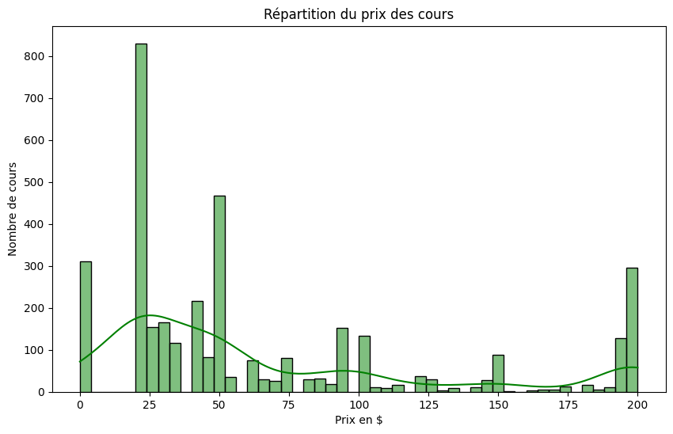
    


La majorité des cours coûtent entre 20 & 50 dollars.


```python
bins = [0, 25, 50, 75, 100, 125, 150, 175, 200]
labels = ['0-25', '25-50', '50-75', '75-100', '100-125', '125-150', '150-175', '175-200']

# Ajouter une colonne 'interval' au DataFrame en utilisant pd.cut()
df['interval'] = pd.cut(df["price"], bins=bins, labels=labels, right=False)

# Calculer la moyenne de 'num_subscribers' pour chaque intervalle de prix
interval_subscribers_mean = df.groupby('interval', observed=False)['num_subscribers'].mean()


# Créer un graphique à barres
plt.figure(figsize=(10, 6))
sns.barplot(x=interval_subscribers_mean.index, y=interval_subscribers_mean.values, color="purple")

# Ajouter des labels et un titre
plt.xlabel("Tranche de prix des cours", fontsize=12)
plt.ylabel("Nombre moyen d'abonnés", fontsize=12)
plt.title("Nombre moyen d'abonnés par intervalle de prix", fontsize=14)

# Rotation des étiquettes sur l'axe X
plt.xticks(rotation=45)

# Afficher le graphique
plt.tight_layout()
plt.show()
```


    
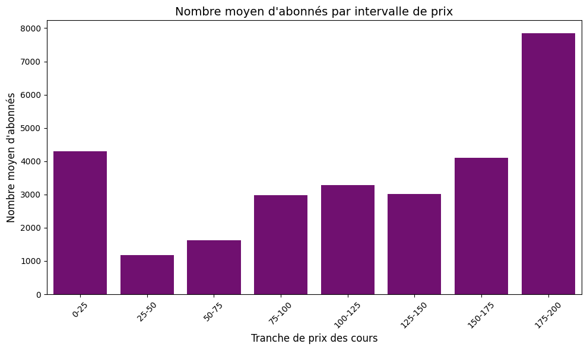
    


On peut remarquer que les cours dont le prix est inférieur à 25 dollars et les cours dont le prix est compris entre 175 et 200 dollars sont les cours avec en moyenne, le plus d'abonnés.


```python
# Calculer la moyenne de 'num_lectures' pour chaque intervalle de prix
interval_lectures_mean = df.groupby('interval', observed=False)['num_lectures'].mean()

# Créer un graphique à barres
plt.figure(figsize=(10, 6))
sns.barplot(x=interval_subscribers_mean.index, y=interval_lectures_mean.values, color="green")

# Ajouter des labels et un titre
plt.xlabel("Tranche de prix des cours", fontsize=12)
plt.ylabel("Nombre moyen de leçons", fontsize=12)
plt.title("Nombre moyen de leçons par intervalle de prix", fontsize=14)

# Rotation des étiquettes sur l'axe X
plt.xticks(rotation=45)

# Afficher le graphique
plt.tight_layout()
plt.show()

```


    
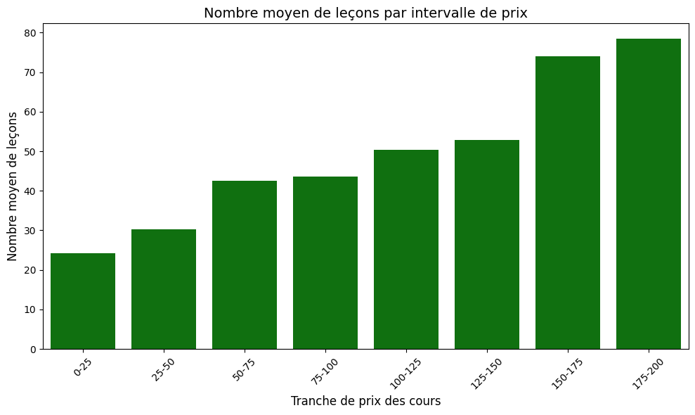
    


On remarque qu'il existe une corrélation entre le prix du cours & le nombre de leçons contenu dans celui-ci.


```python
# Calculer la moyenne de 'num_lectures' pour chaque intervalle de prix
interval_duration_mean = df.groupby('interval', observed=False)['content_duration'].mean()

# Créer un graphique à barres
plt.figure(figsize=(10, 6))
sns.barplot(x=interval_duration_mean.index, y=interval_duration_mean.values, color="green")

# Ajouter des labels et un titre
plt.xlabel("Tranche de prix des cours", fontsize=12)
plt.ylabel("Durée moyenne des cours", fontsize=12)
plt.title("Durée moyenne des cours par intervalle de prix", fontsize=14)

# Rotation des étiquettes sur l'axe X
plt.xticks(rotation=45)

# Afficher le graphique
plt.tight_layout()
plt.show()
```


    
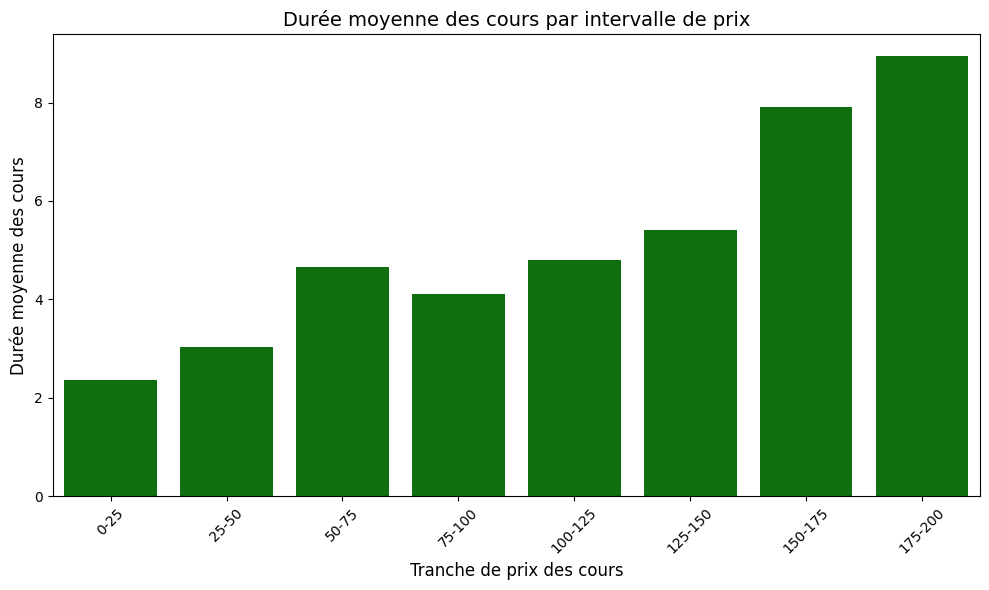
    


On remarque que plus le coût d'un cours est elevé, plus sa durée augmente.

## Répartition des abonnés de la plateforme


```python
# Agréger les données pour obtenir le nombre moyen d'abonnés par niveau
level_mean_subscribers = df.groupby('level')['num_subscribers'].mean().reset_index()

# Créer un graphique à barres
plt.figure(figsize=(10, 6))
ax1 = sns.barplot(
    x='level', 
    y='num_subscribers', 
    data=level_mean_subscribers, 
    hue = 'level',
    palette='rocket'
)

# Ajouter des labels sur les barres
for container in ax1.containers:
    ax1.bar_label(container, fmt='%.0f', label_type='edge', fontsize=10, color='black', padding=3)

# Ajouter des labels et un titre
plt.xlabel("Niveau des cours", fontsize=12)
plt.ylabel("Nombre moyen d'abonnés", fontsize=12)
plt.title("Nombre moyen d'abonnés par niveau de cours", fontsize=14)

# Rotation des étiquettes sur l'axe X
plt.xticks(rotation=45)

# Afficher le graphique
plt.tight_layout()
plt.show()

```


    
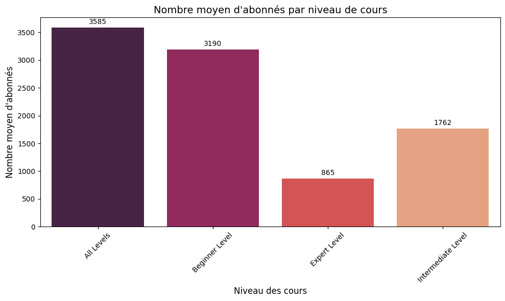
    


```python
 data_level
```


    level
    All Levels            1929
    Beginner Level        1270
    Intermediate Level     421
    Expert Level            58
    Name: count, dtype: int64


Au vu du nombre de chaque type de niveau, le nombre d'abonnés moyen est cohérent.


```python
df.columns
```


    Index(['course_id', 'course_title', 'is_paid', 'price', 'price_category',
           'num_subscribers', 'num_reviews', 'num_lectures', 'level',
           'content_duration', 'published_time', 'year', 'subject', 'revenue',
           'interval'],
          dtype='object')


## Prix et niveaux des cours


```python
level_mean_price = df.groupby('level')['price'].mean().reset_index()
# Créer un graphique à barres
plt.figure(figsize=(10, 6))
ax1 = sns.barplot(
    x='level', 
    y='price', 
    data=level_mean_price, 
    hue = 'level',
    palette='rocket'
)

# Ajouter des labels sur les barres
for container in ax1.containers:
    ax1.bar_label(container, fmt='%.0f', label_type='edge', fontsize=10, color='black', padding=3)

# Ajouter des labels et un titre
plt.xlabel("Niveau des cours", fontsize=12)
plt.ylabel("Prix moyen des cours", fontsize=12)
plt.title("Prix moyen des cours par niveau de cours", fontsize=14)

# Rotation des étiquettes sur l'axe X
plt.xticks(rotation=45)

# Afficher le graphique
plt.tight_layout()
plt.show()

```


    
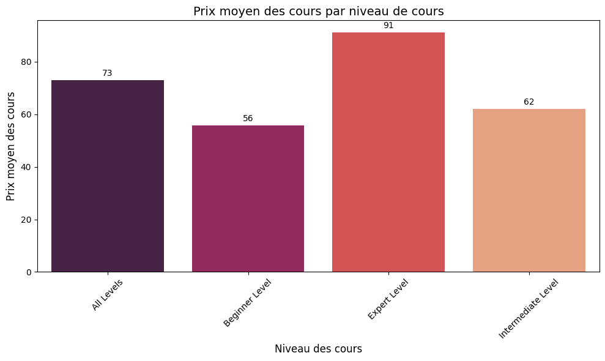
    


Le prix moyen des cours est cohérent vis à vis du niveau de diffculté.  
Plus le niveau est elevé, plus le prix moyen est elevé.


```python
# Créer un graphique à barres
plt.figure(figsize=(10, 6))
ax2 = sns.countplot(x='subject', data=df, palette='rocket', hue='subject')

for container in ax2.containers:
    ax2.bar_label(container, fmt='%d', label_type='edge', fontsize=10, color='black', padding=3)

# Ajouter des labels et un titre
plt.xlabel("Thème des cours", fontsize=12)
plt.ylabel("Nombre de cours", fontsize=12)
plt.title("Nombre de cours par thème", fontsize=14)

# Rotation des étiquettes sur l'axe X
plt.xticks(rotation=45)

# Afficher le graphique
plt.tight_layout()
plt.show()
```


    
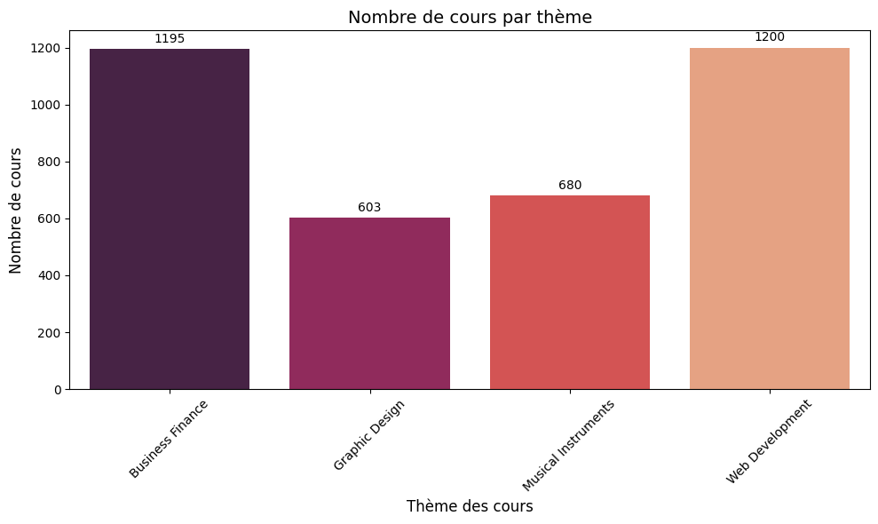
    


```python
# Créer un diagramme box plot
plt.figure(figsize=(10, 6))
sns.boxplot(x='subject', y='year', data=df)

# Personnalisation du graphique
plt.title("Distribution des années de parution des cours par sujet")
plt.xlabel("Sujet")
plt.ylabel("Année")
plt.xticks(rotation=45)
plt.tight_layout()

# Afficher le graphique
plt.show()
```


    
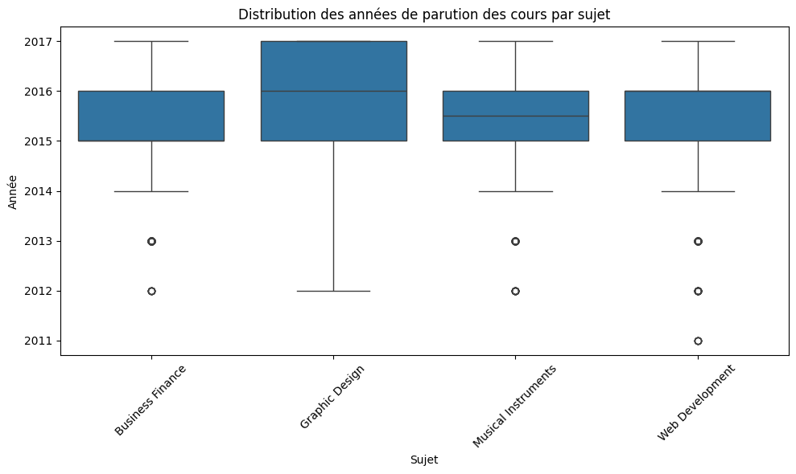
    


Le nombre d'abonnés par sujet de cours est cohérent. En effet, on constate que "Business Finance" & "Web Développement" sont les sujets qui sont apparus en premiers et en grand nombre à partir de 2014.


## Synthèse revenus et cours les plus suivis


```python
revenue_by_year = df.groupby('year')['revenue'].sum().reset_index()

plt.figure(figsize=(10, 6))
plt.plot(revenue_by_year['year'], revenue_by_year['revenue'], marker='x', color='skyblue')

plt.title('Total des revenus par an')
plt.ylabel('Revenus totaux')
# Afficher le graphique
plt.grid(True)
plt.show()
```


    
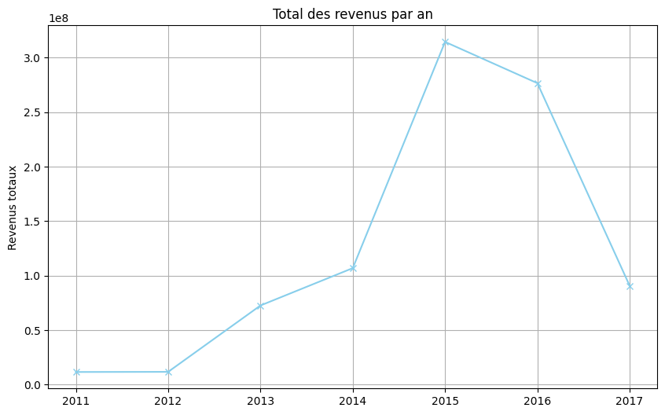
    


```python
# Conversion de 'is_paid' si nécessaire
df['is_paid'] = df['is_paid'].astype(int)

# Filtrer et regrouper par année
free_course = df[df['is_paid'] == 0].groupby('year')[['num_lectures']].sum().reset_index()

# Tracer le graphique
plt.figure(figsize=(10, 6))
plt.plot(free_course['year'], free_course['num_lectures'], marker='x', color='skyblue')

# Ajouter un titre et des labels
plt.title('Nombre total de cours gratuits par année', fontsize=14)
plt.xlabel('Année', fontsize=12)
plt.ylabel('Nombre total de cours', fontsize=12)

# Afficher le graphique
plt.grid(True)
plt.tight_layout()
plt.show()

```


    
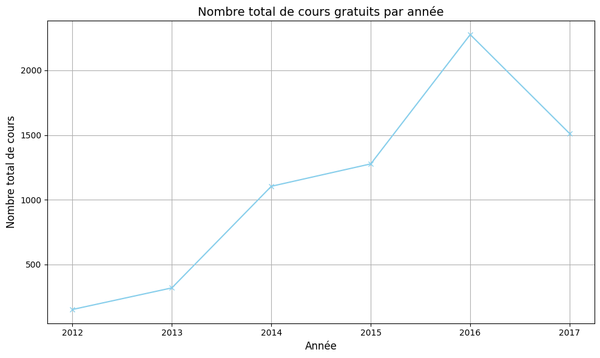
    


On remarque une nette baisse des revenus en 2016, qui peut s'expliquer par la forte augmentation de cours gratuit. L'année 2017 semble montré un déclin de la plateforme, que ce soit en terme de revenu et de nombre total de cours. Pour confirmer cette hypothèse, il faudrait récupérer les données d'Udemy après 2017.


```python

# Trier les cours par nombre d'abonnés décroissant
df_top_10 = df.nlargest(10, "num_subscribers")[["course_title", "num_subscribers", "subject", "is_paid", "price", "level"]].sort_values(by="num_subscribers", ascending=False)

# Créer un dégradé de couleurs basé sur le nombre d'abonnés
norm = plt.Normalize(df_top_10["num_subscribers"].min(), df_top_10["num_subscribers"].max())
colors = cm.Reds(norm(df_top_10["num_subscribers"]))

# Création du graphique à barres horizontales
plt.figure(figsize=(10, 6))
bar = plt.barh(df_top_10["course_title"], df_top_10["num_subscribers"], color=colors)

# Ajouter les valeurs des nombres d'abonnés à côté des barres
for i, bar_item in enumerate(bar):
    plt.text(
        bar_item.get_width() + 1000,  # Position légèrement à droite de la barre
        bar_item.get_y() + bar_item.get_height() / 2,  # Centré sur l'axe y
        f"{int(df_top_10['num_subscribers'].iloc[i])}",  # Texte affiché
        va="center",  # Alignement vertical
        fontsize=10,  # Taille du texte
        color="black"
    )

# Ajouter le titre et les axes
plt.title("Les 10 cours les plus populaires", fontsize=14)
plt.xlabel("Nombre d'abonnés", fontsize=12)
plt.ylabel("Titre du cours", fontsize=12)
plt.yticks(fontsize= 8)
# Inverser l'axe des y pour afficher le cours avec le plus d'abonnés en haut
plt.gca().invert_yaxis()

# Ajuster la mise en page pour une meilleure lisibilité
plt.tight_layout()
plt.show()

```


    
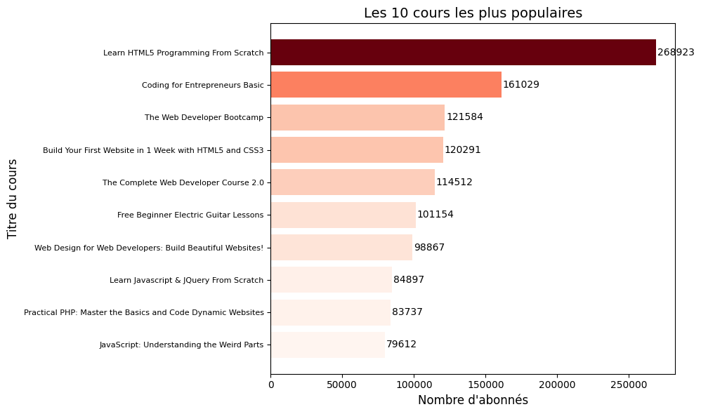
    


On peut constater qu'en dehors du cours "Free Beginner Electric Guitar Lessons", les cours ayant le plus d'abonnées font tous partie du thème " Web Developpment". 


```python
df_10= pd.DataFrame(df_top_10, columns=["course_title","subject", "is_paid", "price", "level"])
df_10
```


<div>
<table border="1" class="dataframe">
  <thead>
    <tr style="text-align: right;">
      <th></th>
      <th>course_title</th>
      <th>subject</th>
      <th>is_paid</th>
      <th>price</th>
      <th>level</th>
    </tr>
  </thead>
  <tbody>
    <tr>
      <th>2827</th>
      <td>Learn HTML5 Programming From Scratch</td>
      <td>Web Development</td>
      <td>0</td>
      <td>0</td>
      <td>All Levels</td>
    </tr>
    <tr>
      <th>3032</th>
      <td>Coding for Entrepreneurs Basic</td>
      <td>Web Development</td>
      <td>0</td>
      <td>0</td>
      <td>Beginner Level</td>
    </tr>
    <tr>
      <th>3230</th>
      <td>The Web Developer Bootcamp</td>
      <td>Web Development</td>
      <td>1</td>
      <td>200</td>
      <td>All Levels</td>
    </tr>
    <tr>
      <th>2783</th>
      <td>Build Your First Website in 1 Week with HTML5 ...</td>
      <td>Web Development</td>
      <td>0</td>
      <td>0</td>
      <td>Beginner Level</td>
    </tr>
    <tr>
      <th>3232</th>
      <td>The Complete Web Developer Course 2.0</td>
      <td>Web Development</td>
      <td>1</td>
      <td>200</td>
      <td>All Levels</td>
    </tr>
    <tr>
      <th>1896</th>
      <td>Free Beginner Electric Guitar Lessons</td>
      <td>Musical Instruments</td>
      <td>0</td>
      <td>0</td>
      <td>Beginner Level</td>
    </tr>
    <tr>
      <th>2589</th>
      <td>Web Design for Web Developers: Build Beautiful...</td>
      <td>Web Development</td>
      <td>0</td>
      <td>0</td>
      <td>All Levels</td>
    </tr>
    <tr>
      <th>2619</th>
      <td>Learn Javascript &amp; JQuery From Scratch</td>
      <td>Web Development</td>
      <td>1</td>
      <td>30</td>
      <td>All Levels</td>
    </tr>
    <tr>
      <th>3289</th>
      <td>Practical PHP: Master the Basics and Code Dyna...</td>
      <td>Web Development</td>
      <td>0</td>
      <td>0</td>
      <td>All Levels</td>
    </tr>
    <tr>
      <th>3247</th>
      <td>JavaScript: Understanding the Weird Parts</td>
      <td>Web Development</td>
      <td>1</td>
      <td>175</td>
      <td>All Levels</td>
    </tr>
  </tbody>
</table>
</div>


La majorité des cours les plus suivis est gratuite. (60%)
